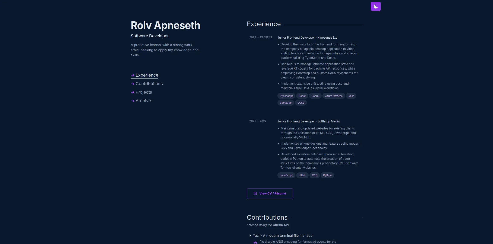

# Developer Portfolio

## Description

My personal developer portfolio, built from scratch using [Leptos](https://leptos.dev/), which can be found at [rolvapneseth.com](https://rolvapneseth.com )

## Tools/Technologies

- [Leptos](https://leptos.dev/)
- [Tailwind CSS](https://tailwindcss.com/)
- [Cloudflare Pages](https://pages.cloudflare.com/) for hosting and continuous deployment

## Credit

Thanks to [bchiang7](https://github.com/bchiang7) as the design is heavily inspired by her [portfolio website](https://brittanychiang.com/).
